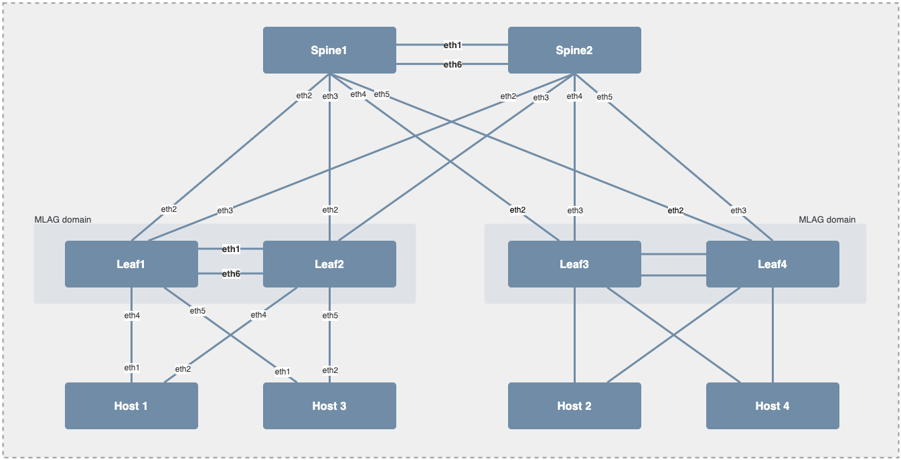

# Arista ATD Emulation on Containerlab

Basic EVPN/VXLAN setup based on [containerlab](https://containerlab.dev/) and [Arista AVD collection](https://avs.arista.com) to build configuration.

## Documentation

- [Devices documentation]({{cookiecutter.project | slugify}}-inventory/documentation/devices/).
- [Fabric documentation]({{cookiecutter.project | slugify}}-inventory/documentation/fabric/).
- [Startup configurations]({{cookiecutter.project | slugify}}-inventory/intended/configs).
- [Fabric state report]({{cookiecutter.project | slugify}}-inventory/reports/ATD_FABRIC-state.md).

## Requirements

- Python3 `>=3.9` with venv support
- Containerlab in version `>=0.55.0`
- Ansible
- Arista anta
- EOS Dowloader CLI

## Getting started

```bash
# Build and configure virtual-env
make setup

# Download cEOS image (Update version accordingly)
ardl get eos --image-type cEOS --version {{cookiecutter.eos_version}} --import-docker

# Build artifact
ansible-playbook playbooks/atd-fabric-deploy.yml --tags build

# Start topology
containerlab deploy
```

## Topology Overview



- Inventory file: [atd-inventory/inventory.yml]({{cookiecutter.project | slugify}}/{{cookiecutter.project | slugify}}-inventory/inventory.yml)
- AVD variables: [atd-inventory/group_vars]({{cookiecutter.project | slugify}}/{{cookiecutter.project | slugify}}-inventory/group_vars)

## Authentication

### Arista devices

- Username: __admin__ (password: _none_)
- Username: __arista__ (password: `arista`)

### Host devices

- Username: __root__ (password: `password123`)

## Management IPs

### Arista EOS containers

| Hostname | Management Interface | IP Address      |
| -------- | -------------------- | --------------  |
| Spine1   | Management0          | {{ cookiecutter.oob_subnet | generate_mgmt_ip(10) }}/24 |
| Spine2   | Management0          | {{ cookiecutter.oob_subnet | generate_mgmt_ip(11) }}/24 |
| Leaf1    | Management0          | {{ cookiecutter.oob_subnet | generate_mgmt_ip(12) }}/24 |
| Leaf2    | Management0          | {{ cookiecutter.oob_subnet | generate_mgmt_ip(13) }}/24 |
| Leaf3    | Management0          | {{ cookiecutter.oob_subnet | generate_mgmt_ip(14) }}/24 |
| Leaf4    | Management0          | {{ cookiecutter.oob_subnet | generate_mgmt_ip(15) }}/24 |

### Linux containers

| Hostname | Managemnt Interface | IP Address      |
| -------- | ------------------- | --------------  |
| Host1    | Eth0                | {{ cookiecutter.oob_subnet | generate_mgmt_ip(16) }}/24 |
| Host2    | Eth0                | {{ cookiecutter.oob_subnet | generate_mgmt_ip(17) }}/24 |
| Host3    | Eth0                | {{ cookiecutter.oob_subnet | generate_mgmt_ip(18) }}/24 |
| Host4    | Eth0                | {{ cookiecutter.oob_subnet | generate_mgmt_ip(19) }}/24 |

## Commands details

### Setup project environment

```bash
# Create a virtual-env
python3 -m venv .venv

# Activate virtual env
source .venv/bin/activate

# Install python requirements
pip install -r requirements.txt

# Install ansible requirements
ansible-galaxy collection install -r collections.yml --force
```

It can be wrapped up in a single Make command:

```bash
# Single command provisioning with Make
make setup
```

### Get cEOS images

```bash
# Download cEOS image (Update version accordingly)
ardl get eos --image-type cEOS --version {{cookiecutter.eos_version}} --import-docker
```

Full [`eos-downloader` documentation](https://github.com/titom73/eos-downloader)

### Manage topology

- Specific containerlab and nodes definition [documentation](./docs/clab.md)
- Deploy lab:

```bash
sudo containerlab deploy
```

If graphite image is deployed, You can access lab topology using SSH or your browser with `http://<IP of clab>/graphite`

- Save lab

```bash
sudo containerlab save
```

- Destroy lab

```bash
sudo containerlab destroy
```

### Generate topology diagram

#### For offline usage

```bash
sudo containerlab graph --drawio
```

It generates a draw.io diagram that can be used in project and delivery.

#### For markdown rendering

> Not yet tested in project. May require some tuning.

```bash
sudo containerlab graph --dot --offline
```

### Configuration Management

__Inventory:__

- Inventory file: [atd-inventory/inventory.yml]({{cookiecutter.project | slugify}}/{{cookiecutter.project | slugify}}-inventory/inventory.yml)
- AVD variables: [atd-inventory/group_vars]({{cookiecutter.project | slugify}}/{{cookiecutter.project | slugify}}-inventory/group_vars)

__Commands__

- Build and deploy

```bash
ansible-playbook playbooks/atd-fabric-deploy.yml
```

- Build only

```bash
ansible-playbook playbooks/atd-fabric-deploy.yml --tags build
```

- Build & deploy via eAPI

```bash
ansible-playbook playbooks/atd-fabric-deploy.yml --tags build,deploy_eapi
```

- Build & deploy via CVP

> Be sure to update CVP information in your inventory file.

```bash
ansible-playbook playbooks/atd-fabric-deploy.yml --tags build,deploy_cvp
```


